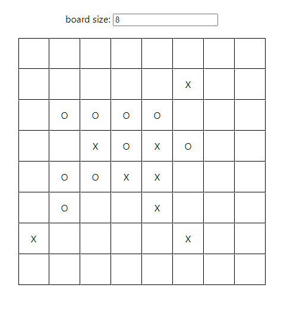

## Крестики-нолики

---

### Функционал

- Выбор размера доски
- Мультиплеер на 2 игрока
- Победил тот, кто первый выстроил линию из 5 крестиков или ноликов

### Применяемые технологии

- React
- Redux
- localStorage

### Запуск:

- `npm install` - устанавливаем зависимости
- `npm run build` - сборка приложения
- `npm run start` - запуск приложения
